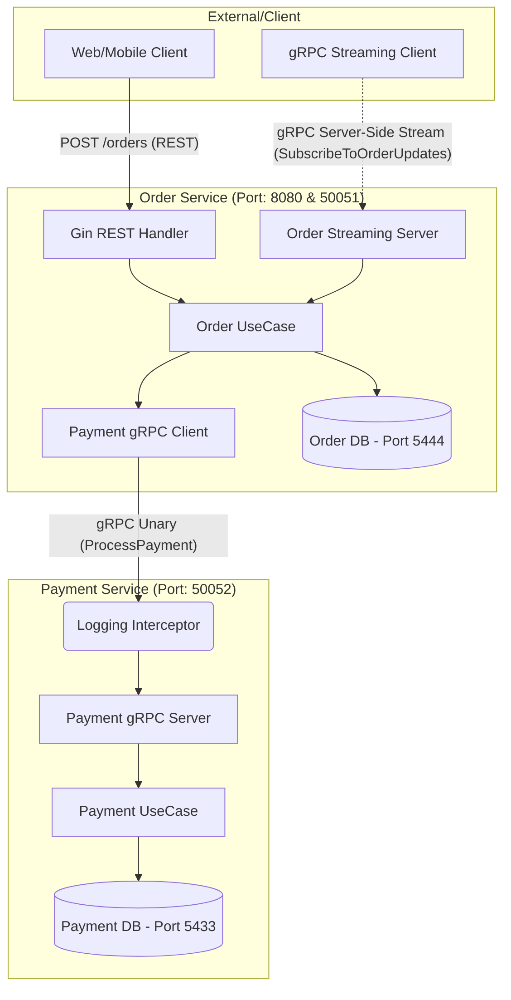

# Assignment 2: gRPC Migration & Contract-First Microservices

* **Repository A (Source Protos):** [https://github.com/B4rt0n1/protoA](https://github.com/B4rt0n1/protoA)
* **Repository B (Generated Code):** [https://github.com/B4rt0n1/protoB](https://github.com/B4rt0n1/protoB)

---

## Architecture Diagram

---

## Idempotency and ACK Logic

### Idempotency Strategy
The notification service implements idempotency using an in-memory deduper that tracks processed event IDs. If a duplicate event ID is received, the message is acknowledged and skipped to prevent reprocessing.

### ACK Logic Implementation
The notification service uses manual ACK/NACK:
- On successful processing, the message is acknowledged (ACK).
- On failure, the message is negatively acknowledged (NACK), triggering retries up to 3 attempts.
- After 3 failed retries, the message is routed to the Dead Letter Queue (DLQ) for manual inspection.